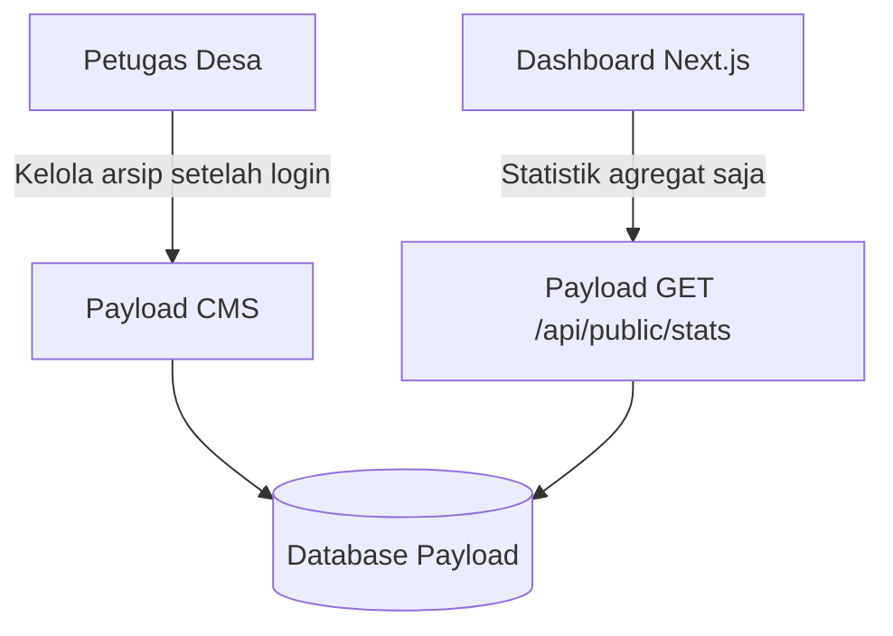

# Arsitektur MyArsip Nikah

## Alur aplikasi aktif

- **Payload CMS (`apps/cms`)** adalah satu-satunya tempat untuk menambah, mengubah, atau menghapus arsip nikah. Dokumen arsip hanya dapat dibaca oleh petugas yang sudah login.
- **Dashboard Next.js (`apps/web`)** hanya menampilkan jumlah arsip, pembatalan, jenis surat, dan tahun. Endpoint statistik tidak mengirim data pribadi arsip.
- **API GraphQL lama (`apps/api`)** dipertahankan sementara sebagai sumber baca untuk migrasi arsip terdahulu. Mutation arsip sudah dinonaktifkan.
- **Prototype HTML/JavaScript statis** dan konfigurasi Supabase miliknya sudah dihapus dari repository.

## Migrasi arsip lama

Sebelum menghentikan sumber API lama:

1. Jalankan API lama dan Payload CMS.
2. Buat backup database sumber dan Payload.
3. Jalankan `npm run migrate:legacy-archives` dari `apps/cms` sesuai [panduan CMS](apps/cms/README.md).
4. Periksa jumlah arsip hasil migrasi dan statistik dashboard.
5. Hentikan API lama setelah hasil migrasi diverifikasi.

Skrip migrasi mempertahankan ID sumber pada field `legacyId`, melewati arsip yang telah diimpor, dan tidak menghapus data dari sumber lama.

## Dokumen teknis

Instruksi menjalankan CMS, migrasi skema database, impor arsip, dan konfigurasi dashboard terdapat di [apps/cms/README.md](apps/cms/README.md).
