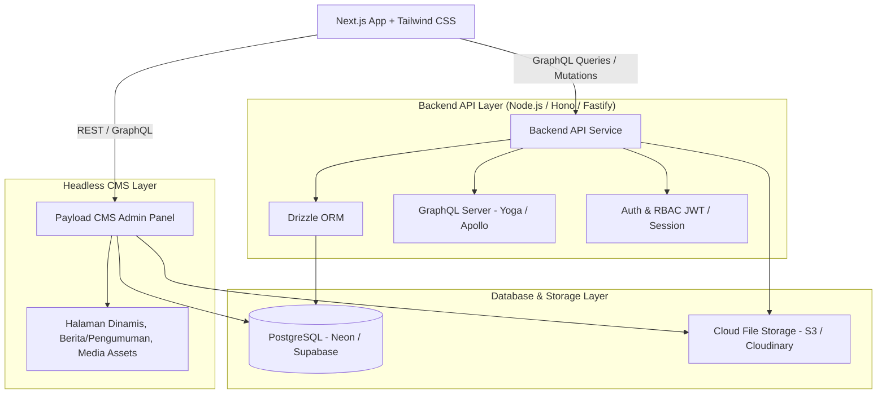

# 📋 Migration Plan: MyArsip Nikah (Next.js + Tailwind + PostgreSQL + Drizzle + GraphQL + Payload CMS)

Dokumen ini adalah rencana teknis dan arsitektur migrasi **MyArsip Nikah - Desa Pelang Kidul** dari prototype vanilla JS ke stack modern berskala produksi.

---

## 1. Arsitektur Sistem Terpisah (Decoupled Architecture)

Sesuai preferensi Anda, arsitektur dibagi menjadi service terpisah:



---

## 2. Tech Stack Detail & Peran

| Komponen | Pilihan Teknologi | Peran dalam Aplikasi |
| :--- | :--- | :--- |
| **Frontend** | **Next.js (App Router)** + **Tailwind CSS** + **shadcn/ui** | UI modern, tema kustom (Matcha, Mega Mendung, Vintage, dll), cepat & modular. |
| **State & Table** | TanStack Table, TanStack Query, React Hook Form + Zod | Validasi ketat NIK/nomor surat, tabel arsip ribuan record, caching responsif. |
| **Backend API** | Node.js + **Hono** atau Fastify + **GraphQL Yoga** | Endpoint GraphQL performa tinggi, schema-driven, typed response. |
| **ORM & Database** | **PostgreSQL** (Neon / Supabase) + **Drizzle ORM** | Type-safe query builder, migrasi skema SQL terstruktur, performa query kilat. |
| **CMS** | **Payload CMS** | Pengelolaan artikel, profil desa, SOP P3N, dan aset media banner. |
| **Storage Lampiran** | **Cloudinary / AWS S3 / Cloudflare R2** | Penyimpanan scan buku nikah, KTP, berkas N1-N7, dan lampiran surat wali. |

---

## 3. Desain Skema Database (Drizzle ORM)

Memperbaiki struktur flat array lama menjadi relasi terstruktur:

### A. Tabel Pengguna & Audit Trail:
- `users`: `id`, `name`, `username`, `email`, `password_hash`, `role` (`SUPERADMIN`, `P3N`, `VIEWER`), `created_at`
- `audit_logs`: `id`, `user_id`, `action` (`CREATE`, `UPDATE`, `DELETE`), `entity_type`, `entity_id`, `changes_json`, `created_at`

### B. Tabel Utama Arsip Nikah:
- `surat_counter`: Mengelola nomor urut surat satu pintu otomatis per tahun (`tahun`, `last_number`, `format_template`).
- `arsip_nikah`:
  - `id` (UUID Primary Key)
  - `nomor_surat` (Indexed, format resmi per tahun)
  - `jenis_surat` (`N_MASUK`, `N_KELUAR`, `ISBAT`, `SURAT_WALI`, `PEMBATALAN`)
  - `tanggal_surat`, `tanggal_akad`, `tahun_arsip` (Indexed)
  - **Calon Suami**: `suami_nama`, `suami_nik`, `suami_desa`, `suami_kecamatan`, `suami_bin`
  - **Calon Istri**: `istri_nama`, `istri_nik`, `istri_desa`, `istri_kecamatan`, `istri_binti`
  - **Data Wali**: `wali_nama`, `wali_status`, `wali_hubungan`
  - **Lampiran Dokumen**: `lampiran_files` (JSONB / relasi tabel lampiran)
  - **Status & Pembatalan**: `is_batal` (Boolean), `alasan_batal`, `catatan`
  - `created_by`, `updated_by`, `created_at`, `updated_at`

---

## 4. Desain GraphQL API

```graphql
enum JenisSurat {
  N_MASUK
  N_KELUAR
  ISBAT
  SURAT_WALI
  PEMBATALAN
}

type ArsipNikah {
  id: ID!
  nomorSurat: String!
  jenisSurat: JenisSurat!
  tanggalSurat: String!
  tanggalAkad: String
  tahunArsip: Int!
  suamiNama: String!
  suamiNik: String
  istriNama: String!
  istriNik: String
  isBatal: Boolean!
  lampiranFiles: [String!]
  createdBy: User
  auditLogs: [AuditLog!]
}

type Query {
  getArsipList(
    jenis: JenisSurat
    tahun: Int
    search: String
    limit: Int
    offset: Int
  ): PaginatedArsip!
  
  getArsipById(id: ID!): ArsipNikah
  getYearlyReport(year: Int!): YearlyReportSummary!
  getArchiveFolders: [ArchiveFolderSummary!]!
}

type Mutation {
  createArsip(input: CreateArsipInput!): ArsipNikah!
  updateArsip(id: ID!, input: UpdateArsipInput!): ArsipNikah!
  deleteArsip(id: ID!, alasan: String!): Boolean!
  generateNextNomorSurat(jenis: JenisSurat!, tahun: Int!): String!
}
```

---

## 5. Rencana Tahapan Eksekusi Migrasi (Step-by-Step)

### **Fase 1: Setup Backend & Database (Postgres + Drizzle + GraphQL)**
1. Inisialisasi service backend Node.js (`pnpm init` / Hono).
2. Setup koneksi PostgreSQL (Supabase / Neon).
3. Buat skema tabel Drizzle (`schema.ts`), generate migration, dan push ke database.
4. Bangun endpoint GraphQL (Query, Mutation, Pagination, Search).
5. Implementasi sistem otentikasi JWT + Role-Based Access Control (RBAC) & logging audit.

### **Fase 2: Setup Payload CMS**
1. Setup instance terpisah untuk Payload CMS.
2. Konfigurasi Collection konten:
   - `pages` / `announcements` (Pengumuman & informasi desa)
   - `p3n-profiles` (Data resmi petugas P3N)
   - `media` (Upload logo, template surat, dokumen regulasi)
3. Sambungkan media adapter ke Cloud Storage (S3 / Cloudinary).

### **Fase 3: Frontend Next.js + Tailwind CSS**
1. Inisialisasi project `nextjs-app` dengan Tailwind CSS & Lucide Icons.
2. Bangun komponen UI:
   - Dashboard statistik real-time.
   - Tabel interaktif data arsip (Filter tahun, pencarian instan, status batal).
   - Form Tambah/Ubah Data dengan validasi Zod & auto counter nomor surat.
   - Lemari Arsip Digital visual (Folder per tahun).
   - Selector tema (Tema Matcha, Mega Mendung, Vintage, Office, White).
3. Hubungkan frontend ke GraphQL backend menggunakan Apollo Client atau TanStack Query.

### **Fase 4: Migrasi Data & Fitur Cetak Resmi**
1. Buat script pemindah data dari data JSON/localStorage lama ke skema PostgreSQL baru.
2. Buat fitur Export Excel dan Print PDF format baku surat nikah desa.
3. Testing hak akses (Super Admin vs P3N vs Viewer) dan deployment.

---

## 6. Rekomendasi Utama untuk Proyek Anda

1. **Nomor Surat Atomik (Database Sequence)**:
   Gunakan transaksi database atomic saat generate nomor surat agar tidak terjadi duplikasi nomor jika ada 2 petugas input bersamaan.
2. **Audit Trail Mutlak**:
   Wajib mencatat riwayat modifikasi data (siapa mengubah apa dan kapan), mengingat arsip pernikahan adalah dokumen legal negara.
3. **Cetak PDF Baku Otomatis**:
   Integrasikan `@react-pdf/renderer` pada Next.js sehingga surat rekomendasi atau keterangan nikah dapat langsung dicetak sesuai format kop resmi desa.
4. **Pratinjau Berkas Dokumen (Scan)**:
   Sediakan fitur upload & pratinjau scan KTP/buku nikah langsung di panel rincian data arsip.
